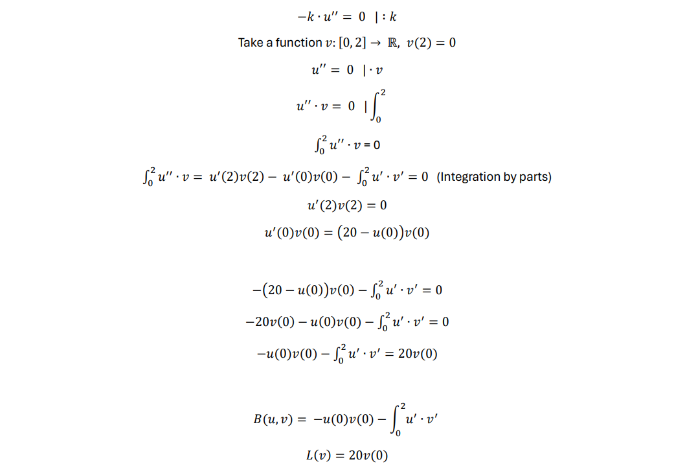
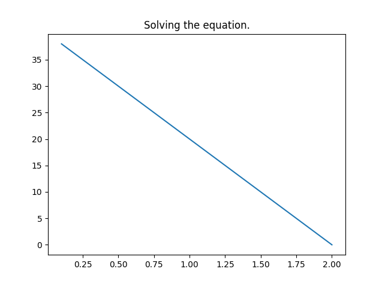

# Solving differential equations using FEM

## Problem


## Solution



Numerical computations were performed in a C++ program.

## Result



## Technologies

- C++
- Eigen
- Matplotlibcpp

## Setup

```
cd FEM/
mkdir build
cd build/
cmake ../
make
./example <number of divisions>
```
